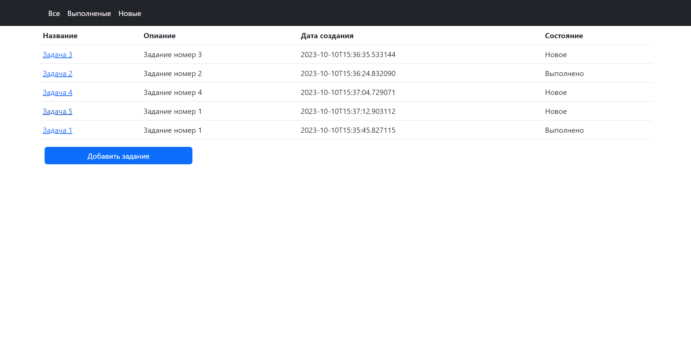
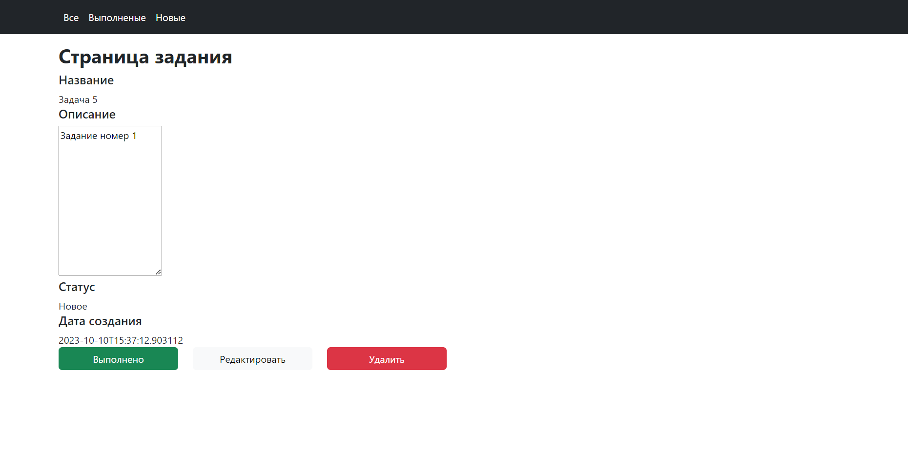
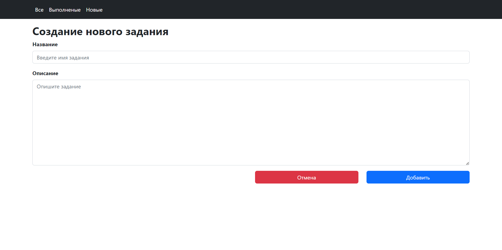
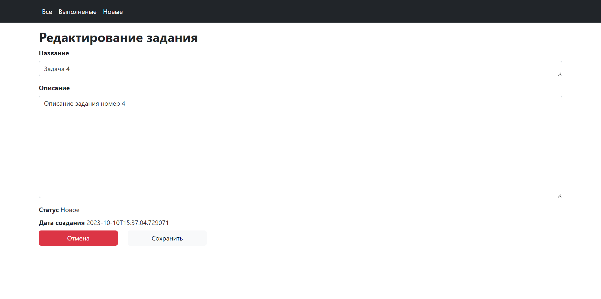

Приложение "TODO список" (job4j_todo)

Приложение "Список Заданий ToDo List" позвоялет вести список задач, создавать, 
редактировать, менять статус этих задач.

Возможности приложения:
1. Просмотр списока всех заданий
2. Добавление/удаление/редактирование заданий
3. Возможность изменение статуса задания (Выполнено/Новое)
4. Сортировка заданий по статусу
5. Удаление задачи

Задание состоит из:
1. Id
2. Описания 
3. Время создания
4. Стутас (Выполнено/Новое)

Стек технологий:
1. Java 17
2. Maven 3.8.1
3. Spring boot 2.7.6
4. Postgres 15.3
5. Hibernate 5.6.11.Final
6. Liquibase 4.15.0
7. Lombok 1.18.22
8. Thymeleaf
9. Bootstrap

Запуск проекта:
1. Создать базу данных '''create database todo;
2. Запустить метод main в классе src/main/java/ru/job4j/todo/Main.java
3. Перейти по ссылке [http://localhost:8080/tasks](http://localhost:8080/tasks)

Страница списка задач

Страница задачи

Страница создания задачи

Страница редактирования задачи
