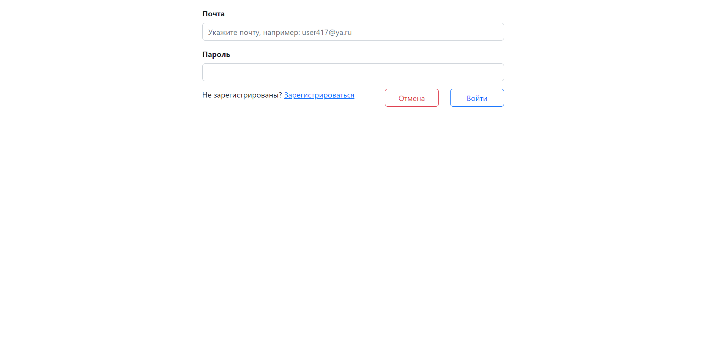

Проект "Список заданий ToDo List" job4j_todo
---

>Это веб приложение реализует CRUD-систему с использованием MVC шаблона.

## Содержание

- [Обшая инофмация](#Общая-информация)
- [Технологии](#Технологии)
- [Запуск проекта](#Запуск-проекта)
- [Скриншоты](#Скриншоты)
- [Контакты](#Контакты)

## Общая информация

Проект представляет собой приложение для управления задачами.
Пользователь может добавлять задачи, удалять, редактировать уже созданные им задачи, сортировать задачи, 
а также менять статус задачи. При регистрации у пользователя есть возможность указать свой часовой пояс, 
тогда даты задач будут отображаться с учетом настроек пользователя. Если пользователь не задал часовоу зону, 
то используется часовая зона по умолчанию. Просматривать и добавлять задачи могуть только 
авторизированные пользователи.

## Технологии

- Java 17
- Database:
    - PostgreSQL 14
    - H2
- JDBC
- Liquibase
- Hibernate
- Spring boot
- Apache TomCat
- HTML, Thymeleaf, Bootstrap
- Junit, Mockito
- Maven

## Запуск проекта

```
create database todo;
```
```
mvn compile;
```

## Скриншоты

#### Главная страница (Список заданий)

#### Страница задания

#### Страница создания задания

#### Страница редактирования задания

#### Страница Регистрации

#### Страница Авторизации



## Контакты

https://github.com/ADIKIAA
